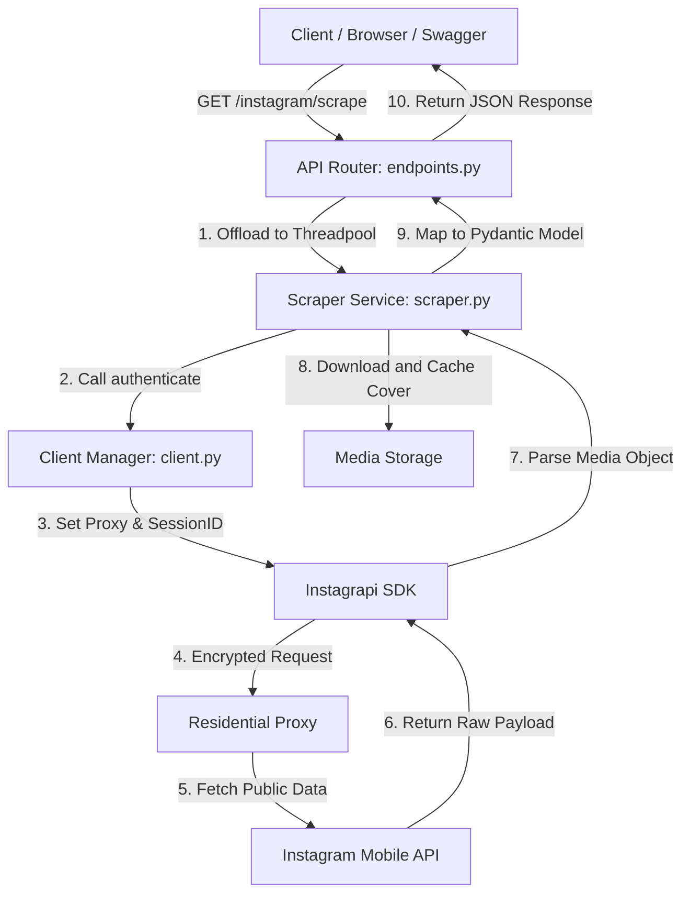

# System Architecture (Clean Architecture)

The Instagram Scraper API is designed following the core principles of **Clean Architecture** and **Separation of Concerns (SoC)**. The primary objective is to isolate critical business logic (scraping workflow, proxy configuration, and session authentication) from the underlying web framework (FastAPI) and global configurations.

This design guarantees that the codebase is highly modular, easily testable, and prepared to scale for future feature additions such as Database/SQLModel integrations, LLM pipelines, and CRUD APIs.

---

## Flow of Control

The diagram below outlines how an incoming HTTP request traverses through the layers of the application:



---

## Architectural Layers (Separation of Concerns)

### 1. HTTP Presentation & Routing Layer (`app/api/`)
* **Responsibility:** Accepts incoming HTTP requests, performs basic schema validation of query parameters via Pydantic, and returns JSON responses with matching HTTP status codes.
* **Strict Rule:** No business scraping logic or directly imported scraper configurations should reside here. It orchestrates service calls and translates custom service exceptions (such as `InstagramRateLimitException`) into standard HTTP status responses (e.g., `HTTP 429`).
* **Concurrency:** Uses Starlette's `run_in_threadpool` utility to execute synchronous blocking I/O Instagrapi scraper service methods in background worker threads, preventing FastAPI's event loop from freezing.

### 2. Business Service Layer (`app/services/`)
This layer is split into small modular sub-components to strictly satisfy the **Single Responsibility Principle (SRP)**:
* **`InstagramClientManager` (Authentication & Connection):** Responsible for the lifecycle of the Instagrapi Client instance, configuring residential proxies, and logging in using the active browser SessionID cookie.
* **`InstagramScraperService` (Scraping Workflow):** Responsible for executing the sequence: resolving username into user ID, listing recent media objects, fetching details, downloading photos locally, and mapping details into clean dictionary objects.
* **`InstagramRateLimitException` (Exceptions):** A dedicated domain exception to encapsulate rate-limiting errors returned by Instagram's API.

### 3. Data Validation & Schema Layer (`app/schemas/`)
* **Responsibility:** Defines data contract shapes for incoming and outgoing payloads using **Pydantic Models** (`InstagramPostResponse`).
* **Benefit:** Ensures type safety, compile-time checks, and strict JSON formatting for clients.

### 4. Global Configuration Layer (`app/config.py`)
* **Responsibility:** Loads environment configurations from `.env`, initializes local storage paths, and ensures directories exist.

---

## Dependency Injection (DI) Pattern

This project implements a clean constructor-based **Dependency Injection** pattern in the service layer, making unit testing straightforward:

```python
# Instantiate the client manager
instagram_client = InstagramClientManager()

# Inject the client instance into the scraper service constructor
instagram_service = InstagramScraperService(client_manager=instagram_client)
```

By decoupling these classes, you can easily pass mock client managers during test suite execution without editing any core business scraping logic in `InstagramScraperService`!
